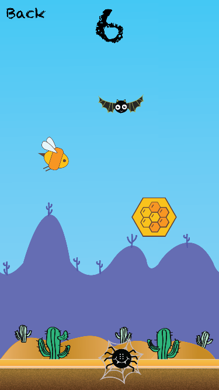

# WebPage
This is the web page for the (Beezy Bee)[https://github.com/cornerstonecollege/beezy-bee]project.

# Beezy Bee
__Beezy Bee__ is an arcade-style game inspired on "Flappy Bird". Beezy bee is meant for iOS devices.

### How to play
Collect flowers and honeycombs to win, but do not forget to avoid the monsters!

### Help
Feel free to help the repository, sending your pull requests.

# [Start Bootstrap](http://startbootstrap.com/) - [Freelancer](http://startbootstrap.com/template-overviews/freelancer/)

[Freelancer](http://startbootstrap.com/template-overviews/freelancer/) is a one page freelancer portfolio theme for [Bootstrap](http://getbootstrap.com/) created by [Start Bootstrap](http://startbootstrap.com/). This theme features several content sections, a responsive portfolio grid with hover effects, full page portfolio item modals, and a working PHP contact form.

## Getting Started

To use this theme, choose one of the following options to get started:
* Download the latest release on Start Bootstrap
* Fork this repository on GitHub

## Bugs and Issues

Have a bug or an issue with this theme? [Open a new issue](https://github.com/IronSummitMedia/startbootstrap-freelancer/issues) here on GitHub or leave a comment on the [template overview page at Start Bootstrap](http://startbootstrap.com/template-overviews/freelancer/).

## Creator

Start Bootstrap was created by and is maintained by **David Miller**, Managing Parter at [Iron Summit Media Strategies](http://www.ironsummitmedia.com/).

* https://twitter.com/davidmillerskt
* https://github.com/davidtmiller

Start Bootstrap is based on the [Bootstrap](http://getbootstrap.com/) framework created by [Mark Otto](https://twitter.com/mdo) and [Jacob Thorton](https://twitter.com/fat).

## Copyright and License

Copyright 2013-2015 Iron Summit Media Strategies, LLC. Code released under the [Apache 2.0](https://github.com/IronSummitMedia/startbootstrap-freelancer/blob/gh-pages/LICENSE) license.
